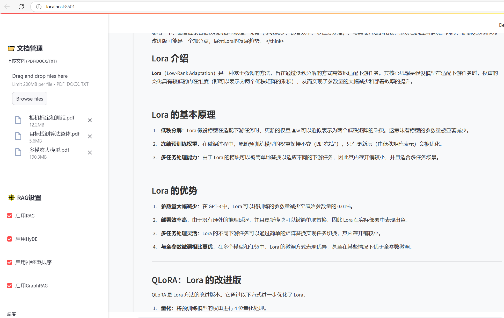

# DeepSeek-RAG-Mindtree



Mindtree-RAG leverages DeepSeek-7B, BM25, FAISS, Neural Reranking (Cross-Encoder), GraphRAG, and Chat History Integration to efficiently retrieve information from PDFs, DOCX, and TXT files with speed, accuracy, and explainability.


### **Clone the Repository & Install Dependencies**
```
git clone https://github.com/allrivertosea/DeepSeek-RAG-Mindtree.git
cd DeepSeek-RAG-Mindtree
conda create --name mindtree python=3.10
activate mindtree
pip install -r requirements.txt -i https://pypi.tuna.tsinghua.edu.cn/simple
pip3 install torch torchvision torchaudio --index-url https://download.pytorch.org/whl/cu118
```

### **Download model**
```
Download Ollama → https://ollama.com/
ollama pull deepseek-r1:7b
ollama pull nomic-embed-text
```

### **Run**
```
streamlit run app.py
http://localhost:8501
```


# **但建议使用步骤 A) 以获得更好的体验..**

